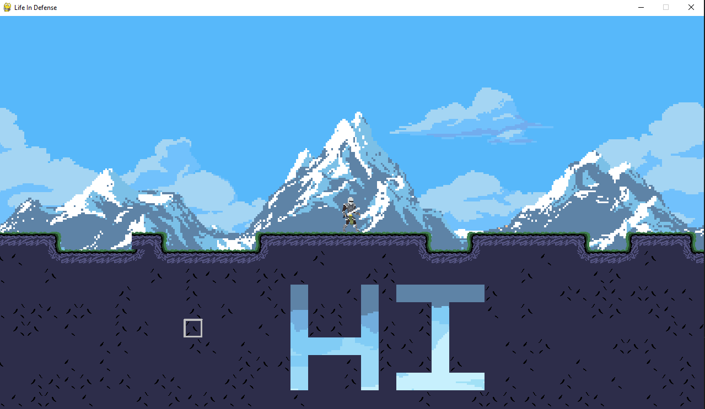

In this repository I will be making a 2D terraria like game in python's pygame where the player can build and craft, and other mobs will attack them and create their own buildings.

Tile size will be 32 pixels

## Note : This project has been archived in favor of a C++ and OpenGL version in a currently private repository. Please feel free to use this however as inspiration, as it is fully functional!

Current Features
- Player Movement (wasd)
- Block Breaking (left click)
- Block Placing partially implemented (right click)
- Infinite terrain both vertically and horizontally
    - Chunks loaded in and out of memory
- Custom textures for the blocks

To Run
1. cd into the code directory
2. (Optional) Create an activate a virtual environment: python -m venv venv ; .\venv\Scripts\activate
3. Install the dependencies: pip3 install -r requirements.txt
4. Run the entrypoint: python .\main.py

